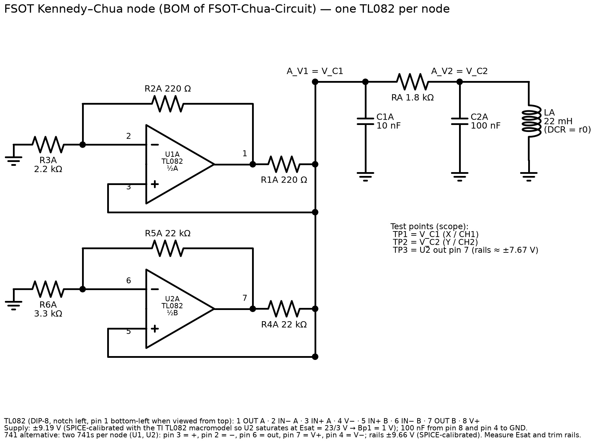
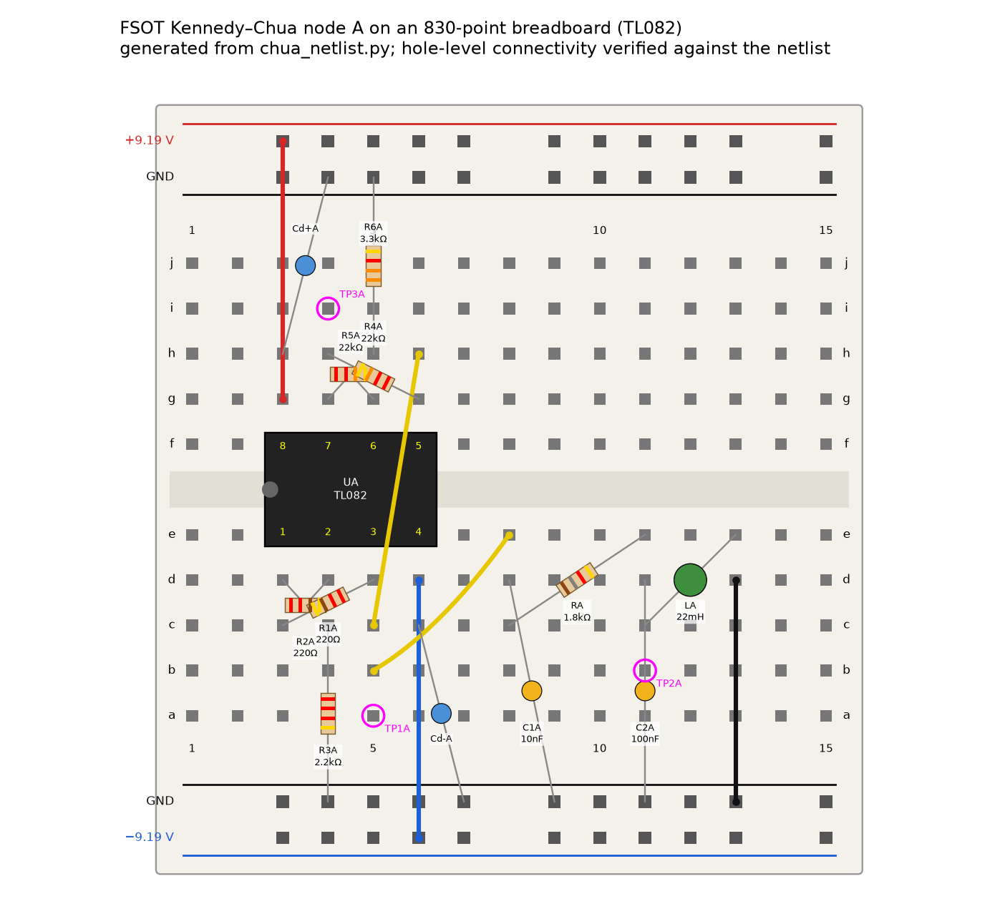
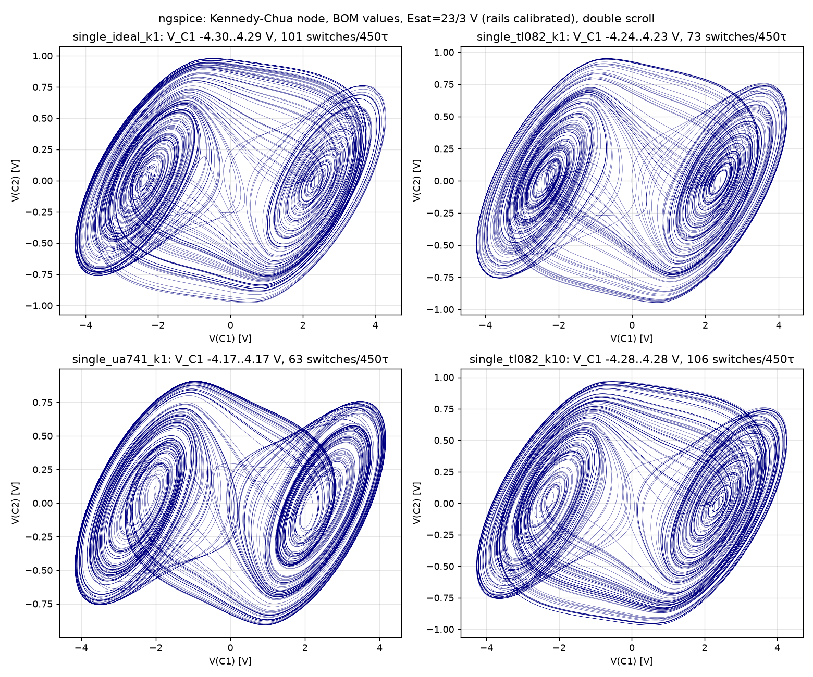
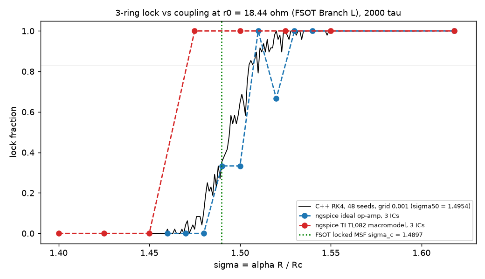
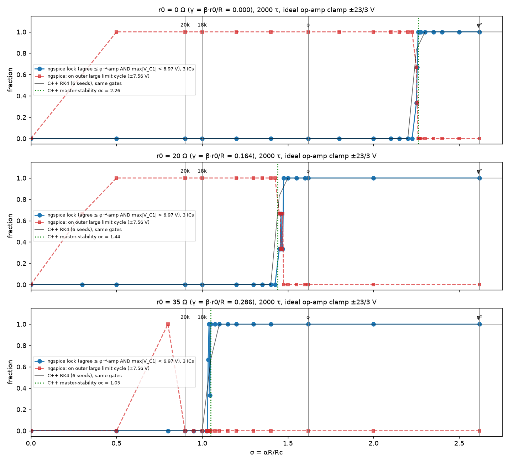

# FSOT-Chua-Circuit

A **coupled Chua circuit** — in the electronics literature, a nonlinear RLC oscillator with a piecewise-linear negative resistor (the “Chua diode”), tiled here as a **3-node ring**.

This repository is a **physical application** of Fluid Spacetime Omni-Theory (FSOT). Analog voltages occupy three regions \((-1,\,0,\,+1)\). An ESP32 12-bit ADC is the observer. The prediction you can build this afternoon is a coupling resistance, not a fitted neural net.

| | |
|--|--|
| **What it is** | 3 identical Chua nodes, resistively coupled in a triangle |
| **Field name** | Coupled Chua circuit / nonlinear RLC oscillator array |
| **FSOT pin** | **AEB2AD** (`vendor/fsot_compute.py`) |
| **Domain** | Electromagnetism, \(D_{\mathrm{eff}}=7\) (nest) |
| **Sharp prediction** | lock threshold \(\sigma_c=1.4897\) (\(R_c^{\ast}=12.08\,\mathrm{k}\Omega\)), from FSOT Branch L \(\gamma\) |
| **Robust gate** | \(\sigma=\varphi^2\), \(R_c=\alpha R/\varphi^2=6875.39\,\Omega\) locks |
| **Unlocked gates** | \(\sigma=0\), \(\sigma=1\), \(R_c=20\,\mathrm{k}\Omega\): no LOCK (amplitude-checked) |
| **Free parameters** | **0** |
| **License** | [Apache License 2.0](LICENSE) |
| **Author** | Damian Arthur Palumbo |

Anyone with a breadboard, two 9 V batteries, an ESP32 DevKit, and Python 3.11 can run the software gate and then the hardware experiment. Hub math lives in [FSOT-2.1-Lean](https://github.com/dappalumbo91/FSOT-2.1-Lean). **A green hub does not certify this board.** This tree re-proves its own obligations.

**Hands-on build:** [docs/BUILD_TUTORIAL.md](docs/BUILD_TUTORIAL.md) · [docs/tutorial.html](docs/tutorial.html)  
**Parts and pins:** [hardware/BOM.md](hardware/BOM.md) · [hardware/schematic.md](hardware/schematic.md)  
**Claims / kill:** [docs/CLAIMS.md](docs/CLAIMS.md)  
**Status:** [docs/STATUS.md](docs/STATUS.md)

---

## What this is trying to accomplish

1. Map FSOT **trinary states** onto real analog voltages without CPU floating-point:
   - \(V_{C1} < -1\,\mathrm{V}\) → **−1** (inhibition / damping)
   - \(\lvert V_{C1}\rvert \le 1\,\mathrm{V}\) → **0** (quiescent)
   - \(V_{C1} > +1\,\mathrm{V}\) → **+1** (excitation / emergence)
2. Predict, with **zero free parameters**, the coupling at which three identical chaotic oscillators **phase-lock**: \(\sigma_c=1.4897\), i.e. lock for \(R_c<12.08\,\mathrm{k}\Omega\).
3. Let an independent builder **falsify that prediction** with three potentiometers and a serial log.

If pots at **6.88 kΩ** (\(\sigma=\varphi^2\)) never lock, or pots at **20 kΩ** read LOCK with the amplitude condition on, or the measured threshold lies outside \(R_c^{\ast}=\alpha R/(1.4897\pm0.05)\) = 11.70–12.50 kΩ, with three identical nodes and a safe ADC bias, the **application is false**. Do not retune \(\varphi\) or \(r_0\). Bench cross-check of Branch L: the inductor's \(Q\) at 3.39 kHz must be **25.44** (ESR 18.44 Ω).

> **2026-10-03 revision (branch `fix/aeb2ad-long-window`).** The earlier claim “\(\sigma=\varphi\) locks, \(\sigma=1\) does not” came from an 80 τ integration with `np.clip(±8)` and a wrong NIC slope (\(b=-6/11\)). With the correct Kennedy slopes (\(b=-81/110\), outer \(c=909/110\)), no clip, a 2000 τ window, and an amplitude check, an **ideal** inductor gives \(\sigma_c=2.26\) (so \(\varphi\) does not lock). Below \(\sigma_c\) the ring escapes to the outer ±7.35 V limit cycle, where the nodes also synchronise, so a trit-only LOCK would read LOCK at 20 kΩ. FSOT 2.1 Branch L derives the inductor loss \(\gamma=0.15087\) (\(r_0=18.44\,\Omega\), [docs/BRANCH_L_DERIVATION.md](docs/BRANCH_L_DERIVATION.md)). With it, \(\sigma_c=1.4897\) was locked (sha256 `04ebe3f4…`, `d6bd17be…`) **before** the sweep, and the 2000 τ sweep measured 1.525. \(\sigma=\varphi\) still locks (6/6) but is **demoted**: it is a consequence of \(\sigma_c<\varphi\) (margin 8 %), not a stand-alone claim.


## Try it live (Falstad CircuitJS, runs in the browser, no login)

| circuit | ideal inductor (r0 = 0) | FSOT Branch L inductor loss (r0 = 18.44 Ω) |
|---|---|---|
| Single Chua node (double scroll) | [open single node, r0 = 0](https://www.falstad.com/circuit/circuitjs.html?ctz=CQAgjCBMB0CsCmBaADAdnM5JZdt3SYYAUAIYgCcAbOGJOFVkfQBwirRVfc8-qIdeQ7ujCZxWSRgnEA7pRrUQVACwKQyYpDTK1SsIppqAggH0AciXn7IbVeFsatO+3TYGHbE6YBqVhkx04BT0zE7aoiG09JAqgfTeAPIk5EqQsQFQGWyCwkL8uXl80hIaZWIy1jTadmo14S51yO7VzSDe5pBy6rFY9r0N6P1xDFAj3n7dBljpamBRs4PBMRkDi0ldAE4gAMzIaixYe3MqakyHyNCaEbv7IIe3aipeIGaTN8fgp4-gqEavvi6AGNdiwDkcwV8zuAkG1LhB4c50DtIQ8UU8Xm8SABzUEnNTozKSYgglT2B5k-HlWHoS6SK5I9rkrCU9qYwHEXGssDfbmMMqaAA22G+D1g3x50Lp6SW4vBIox7QBPi6uLlUIVRKc2yo2T6GUlZXSdMZuvlZrZSqxpoN3wtYD+VtMyWI21Qdwe7qpM20DJuXvuWADzydLv9d0NAYd-zMlldPwGn0+Pswfp0n0Td3qHRxPyTdx22gF8cJichyay4jTyMhZaa7Pe6fLBfLOxjzq2TLq43sFeNqeuOlZA2HbQ2jNZn0nbadnXj6oG6orOz2JpuC5GC7HALnau+nyXReJAHtfroyipIBQmBpoNCYsSgA) | [open single node, r0 = 18.44 Ω](https://www.falstad.com/circuit/circuitjs.html?ctz=CQAgjCBMB0CsCmBaADAdnM5JZdt3SYYAUAIYgCcAbOGJOFVkfQBwirRVfc8-qIdeQ7ujCZxWSRgnEA7pRrUQVACwKQyYpDTK1SsIppqAggH0AciXn7IbVeFsatO+3TYGHbE6YBqVhkx04BT0zE7aoiG09JAqgfTeAPIk5EqQsQFQGWyCwkL8uXl80hIaZWIy1jTadmo14S51yO7VzSDe5pBy6rFY9r0N6P1xDFAj3n7dBljpamBRs4PBMRkDi0ldAE4gAMzIaixYe3MqakyHyNCaEbv7IIe3aipeIGaTN8fgp4-gqEavvi6AGNdiwDkcwV8zuAkG1LhB4c50DtIQ8UU8Xm8SABzUEnNTozKSYgglT2B5k-HlWHoS6SK5I9rkrCU9qYwHEXGssDfbmMMqaAA22G+D1g3x50Lp6SW4vBIox7QBPi6NzlUIVv3+ZgAMsRtlRsn0MpKyuk6YzDfKrWylVjLSbvjawH87aZkvr2HcHqg7qaZtoGTdffKQ7akiRg37vmGXdqLCRtp8Bp9PgHMEGdMmRsm2h0cT9U3cdtoBZ7CSnIWmsuJM8jIZWmuz3lmq8Wqzt44ktky6uN7NXzRnrjpWQMx3mAd3GazPrPO27Op71QN1dWdnsLWrvqud5OzEvcWu7mvS8SDasRjbq2AWNBTpgVBRULAQiwqDyHX3jU23XrcdedzXmeTgAPa-LoZQqJAFBMBo95mlAxJAA) |
| 3-node ring at σ = φ² (Rc = 6875.39 Ω) | [open ring φ², r0 = 0](https://www.falstad.com/circuit/circuitjs.html?ctz=CQAgjCBMB0CsCmBaADAdnM5JZdt3SYYAUAIYgCcAbOGJOFVkfQBwirRVfc8-qIdeQ7ujCZxWSRgnEA7pRrUQVACwKQyYpDTK1SsIppqAggH0AciXn7IbVeFsatO+3TYGHbE6YBqVhkx04BT0zE7aoiG09JAqgfTeAPIk5EqQsQFQGWyCwkL8uXl80hIaZWIy1jTadmo14S51yO7VzSDe5pBy6rFY9r0N6P1xDFAj3n7dBljpamBRs4PBMRkDi0ldAE4gAMzIaixYe3MqakyHyNCaEbv7IIe3aipeIGaTN8fgp4-gqEavvi6AGNdiwDkcwV8zuAkG1LhB4c50DtIQ8UU8Xm8SABzUEnNTozKSYgglT2B5k-HlWHoS6SK5I9rkrCU9qYwHEXGssDfbmMMqaAA22G+D1g3x50Lp6SW4vBIox7QBPi6uLlUIVRKc2yo2T6GUlZXSdMZuvlZrZSqxpoN3wtYD+VtMyWI21Qdwe7qpM20DJuXvuWADzydLv9d0NAYd-zMlldPwGn0+Pswfp0n0Td3qHRxPyTdx22gF8cJichyay4jTyMhZaa7Pe6fLBfLOxjzq2TLq43sFeNqeuOlZA2HbQ2jNZn0nbadnXj6oG6orOz2JpuC5GC7HALnau+nyXReJqRosCC02wQRynCKxQEN9vXFEEkwApKmG6ShUSns35og6GJ59CML8QAAIQsfwlFgRx7BgtgAN0bBHA8eClQgyZ5AvM9QiiHClnmeh8MXII1Agl0T2UA1+Qta9HxEEB73op931fKQKnET8aEYWplDhU01B40YhLIiwuiqXQ+kEkZEPsVQmG48ZwN8fwL3tKILUQwiqO7fUnmUxJOynNE7nVc4B0ZYyjjuU4XgwkgPlM-dTMdUSVRJPE2QhNQzJhFAEOgMA8HhWBLMhZ5vPaEM3NzQkl0hWB+WJUlfwpODviYGkNCubLENZCKuyiuyOS5dKnjgpKnGFdUCvVXzpXoRCarFXlouU9y9x8746sqzQdQyAqLV841qx0ryxts9CVJtLrBIyWBXIMkg3Rsz0nOhEbEODNanja8iHJ0AN1SOxaILjbZPnkn4AxTNd0zuK7Lu3M7YruANPlQI9tU8x7IRuysLI+SFfsE57pqBtR3r+mdRMM+NWSu1l-v7O70ARntQeKuGbiRmz7FQGHlLnbZ1Su467iOVdRtJzc7TB3dNSO75PqkTRKIoc9+Q51h2AfR8Cj529nxfN8OI-CSWB-A4lFk6WaA8SX-gAYUgrjKFgvRHFl9WWh1pUVcwzJueWSggi0qJjYGY21BVij1DEaimGQbJeeYqgBbd4XSnYl81YqXj-aWVxMF1wObbEv39ikjAZIEmOFPj-Xpqw-kHbmKI04IjPnd0jABpAW2jI9Ey9Ay8ALlGz4WBL+42oNg7kTuChnL0RaDeBTzq8i5voTAWEAsa6Augh+40VROvptxQke886hWY81ku8KmfMpQWkctRwql8XieOuX3l7Dn4tqtFFrS6lK4ZSa0-cFFXfVU1Gf1SP4l+oOB4LRXytRtoj-sl3huY0Z6fzbs6Za7Bi5BibmXTajIAxL3gRPMMh1oGQybqA86PwxAjE+EQCmANK4RijlgkOSc4xTwjNgrBdB54XUhNgyKeCNraEBk2OYxDCRhwLuDNhtAWxzDAITQu8Ng4Yz4cwqseVREsmDtuYRONXBUO5II5WEcSYSmIeqJhZQVysPQFozRGi5ER06uIzUzBaH3AVlgFgHhDR9BYKgWA0AUQsG0JAHAYBJY7EZLYmgDw-GWgmIAwJhpQmnWmtsQJAxAkVioI45xrj3GeO8b4jwMT0lg0bOgWJHoPArlUZMKJHg4g2JKfYBxTiXHV2ScgLxFAfE3ECaUqxNA2wvHrmkow5ISmgWtAAe1+EhFkkAKBMGyhtKAxJBkOmGe0UZ4yIAQHoFQBExAgA) | [open ring φ², r0 = 18.44 Ω](https://www.falstad.com/circuit/circuitjs.html?ctz=CQAgjCBMB0CsCmBaADAdnM5JZdt3SYYAUAIYgCcAbOGJOFVkfQBwirRVfc8-qIdeQ7ujCZxWSRgnEA7pRrUQVACwKQyYpDTK1SsIppqAggH0AciXn7IbVeFsatO+3TYGHbE6YBqVhkx04BT0zE7aoiG09JAqgfTeAPIk5EqQsQFQGWyCwkL8uXl80hIaZWIy1jTadmo14S51yO7VzSDe5pBy6rFY9r0N6P1xDFAj3n7dBljpamBRs4PBMRkDi0ldAE4gAMzIaixYe3MqakyHyNCaEbv7IIe3aipeIGaTN8fgp4-gqEavvi6AGNdiwDkcwV8zuAkG1LhB4c50DtIQ8UU8Xm8SABzUEnNTozKSYgglT2B5k-HlWHoS6SK5I9rkrCU9qYwHEXGssDfbmMMqaAA22G+D1g3x50Lp6SW4vBIox7QBPi6NzlUIVv3+ZgAMsRtlRsn0MpKyuk6YzDfKrWylVjLSbvjawH87aZkvr2HcHqg7qaZtoGTdffKQ7akiRg37vmGXdqLCRtp8Bp9PgHMEGdMmRsm2h0cT9U3cdtoBZ7CSnIWmsuJM8jIZWmuz3lmq8Wqzt44ktky6uN7NXzRnrjpWQMx3mAd3GazPrPO27Op71QN1dWdnsLWrvqud5OzEvcWu7mvS8SDasRjbq2AWNBTpgVBRULAQiwqDyHX3jU23XrcdedzXmeTipDQsBBNM2BBDknBFMUAhwfBXCiBImACiUmDdEoT40PYuFLPh+hGDhIAAEIJth4GOPYsCOCOQxqHRLTYI4agUZM8hQRBoRRDxSzzPQ-GrkE7Huik6jOvyNqwchIggIhckoZh6FSBU4hUcobT2IwbAMboWksbpSoUUuVS6H0aiqMSNw6SMHjWSZvj+FBzpRDa+mCcol4-k505JnczxHCe3znMOjJzmigXPE5LbIiFBInq6YkqiSeJshCTGhTCKB6dAYB4PCsARZCQXpacLwcQWhJrpCsD8sSpL4RStHZWANIaFcnX6ayZW9TFKVdFyrVPLRDVOMK6pleq6r0sgMr6VNYq8gN5EctuWWbdgyVrXqF4Yr5s01nW3kHad7SrVVX6ajasA7RRHrbGGZVhkd5onc9PrRZV4mMq9MZJf8pmJj8jmfGG6ZblmQE5kBk7A5yPxhuDIGaEmkJg5CEM1uFHwYzmGPw85JVqMjWMLmJ-m9hZ1PY0OUPoKyjlM0T043Kyz32KgFNrUu2zqo56rYxuuM6ALIwC0Th6av9pOo56NqOTa2O3vecT7M+r62B+KjXUrGTGWJ-7nWGyvy2BlCQfyFAwewSHIQU9vwahaEYepWHmSwSjkko+k+zQHhe-8ADClHmW+BkR37eiOB4EdqKHnGZDbvH0CnAlROnAzpwnv0W2IJr8gXBx20pVCO2XLulGpaGaRUtTSHplpzJgLH10qodmeoYhXi3IzRxg9kB-sLIgInLlF-NcxRMXGehFPYxMAvudU58LBRXobUXCda8b-cq3jxFdwUN8nzPiHHIgoS6+ZZQbWwnl9CXKqrYHGiqIH8TuKEifBKQtQUhNBNTfiyewv9qQoFpF1Bm1Mb6wM-qlYam9Rp6HGkKTUcD1TgLmgtRk6pMGigQS-dAWDvhYJ2qHPa504E2mwcdP22QHgyQQZGFwGRwG0Iob9J63ovrILNIGfSYY4HCM-h6KM-Cwznw7pRAKfdgpzB7gI0W8V5E-HbrnSwiNPhEGLH6OggDyyQh7rfXR0J6Y72MSPdKGix7Ezxoo9siieahyptyax3IlGQxge4-sLdJyuOIdTMxwSwAuIsD2dUJjNQhKOJuE6UTrGJICRExGUSlHpPlvtQevlYngDvA+DWL43w62utE50rcZHG2dEompWT7iBywCwDw-plAsBfNAFELBtCQBwLeCgOxGTNJoA8YZ4ZlSsPQGM000z7rE22GMgYYzqxUHabATp68el9K9oMm4iyRiLKJnFBpNA14eA3BfSYCyPDqxOdTPoayNndPmtsgZQybnoWWasmRxyxmsj+aRe0AB7X4BkWSQAoEwTq5ioDEhBS6MF7QIVQogBAeg9hNBAA) |
| 3-node ring at σ = φ (Rc = 11124.61 Ω) | [open ring φ, r0 = 0](https://www.falstad.com/circuit/circuitjs.html?ctz=CQAgjCBMB0CsCmBaADAdnM5JZdt3SYYAUAIYgCcAbOGJOFVkfQBwirRVfc8-qIdeQ7ujCZxWSRgnEA7pRrUQVACwKQyYpDTK1SsIppqAggH0AciXn7IbVeFsatO+3TYGHbE6YBqVhkx04BT0zE7aoiG09JAqgfTeAPIk5EqQsQFQGWyCwkL8uXl80hIaZWIy1jTadmo14S51yO7VzSDe5pBy6rFY9r0N6P1xDFAj3n7dBljpamBRs4PBMRkDi0ldAE4gAMzIaixYe3MqakyHyNCaEbv7IIe3aipeIGaTN8fgp4-gqEavvi6AGNdiwDkcwV8zuAkG1LhB4c50DtIQ8UU8Xm8SABzUEnNTozKSYgglT2B5k-HlWHoS6SK5I9rkrCU9qYwHEXGssDfbmMMqaAA22G+D1g3x50Lp6SW4vBIox7QBPi6uLlUIVRKc2yo2T6GUlZXSdMZuvlZrZSqxpoN3wtYD+VtMyWI21Qdwe7qpM20DJuXvuWADzydLv9d0NAYd-zMlldPwGn0+Pswfp0n0Td3qHRxPyTdx22gF8cJichyay4jTyMhZaa7Pe6fLBfLOxjzq2TLq43sFeNqeuOlZA2HbQ2jNZn0nbadnXj6oG6orOz2JpuC5GC7HALnau+nyXReJqRosCC02wQRynCKxQEN9vXFEEkwApKmG6ShUSns35og6GJ59CML8QAAIQsfwlFgRx7BgtgAN0bBHA8eClQgyZ5AvM9QiiHClnmeh8MXII1Agl0T2UA1+Qta9HxEEB73op931fKQKnET8aEYWplDhU01B40YhLIiwuiqXQ+kEkZEPsVQmG48ZwN8fwL3tKILUQwiqO7fUnmUxJOynNE7nVc4B0ZYyjjuU4XgwkgPlM-dTMdUSVRJPE2QhNQzJhFAEOgMA8HhWBLMhZ5vPaEM3NzQkl0hWB+WJUlfwpODviYGkNCubLENZCKuyiuyOS5dKnjgpKnGFdUCvVXzpXoRCarFXlouU9y9x8746sqzQdQyAqLV841qx0ryxts9CVJtLrBIyWBXIMkg3Rsz0nOhEbEODNanja8iHJ0AN1SOxaILjbZPnkn4AxTNd0zuK7Lu3M7YruANPlQI9tU8x7IRuysLI+SFfsE57pqBtR3r+mdRMM+NWSu1l-v7O70ARntQeKuGbiRmz7FQGHlLnbZ1Su467iOVdRtJzc7TB3dNSO75PqkTRKIoc9+Q51h2AfR8Cj529nxfN8OI-CSWB-A4lFk6WaA8SX-gAYUgrjKFgvRHFl9WWh1pUVcwzJueWSggi0qJjYGY21BVij1DEaimGQbJeeYqgBbd4XSnYl81YqXj-aWVxMF1wObbEv39ikjAZIEmOFPj-Xpqw-kHbmKI04IjPnd0jABpAW2jI9Ey9Ay8ALlGz4WBL+42oNg7kTuChnL0RaDeBTzq8i5voTAWEAsa6Augh+40VROvptxQke886hWY81ku8KmfMpQWkctRwql8XieOuX3l7Dn4tqtFFrS6lK4ZSa0-cFFXfVU1Gf1SP4l+oOB4LRXytRtoj-sl3huY0Z6fzbs6Za7Bi5BibmXTajIAxL3gRPMMh1oGQybqA86PwxAjE+EQCmANK4RijlgkOSc4xTwjNgrBdB54XUhNgyKeCNraEBk2OYxDCRhwLuDNhtAWxzDAITQu8Ng4Yz4cwqseVREsmDtuYRONXBUO5II5WEcSYSmIeqJhZQVysPQFozRGi5ER06uIzUzBaH3AVlgFgHhDSBDoCoTgRBUAUFQN+WxyAqCMlsTQB4vjLQTEAQEw0ITTrTW2AEgYASKxEEcc4h0biPFiG8TcKJIwolg0bOgGJHoPArlUZMSJHg4g2JKfYBxsQEmuPcRQTxqSdABNKVYmgbYXj1x8eUg4JTQLWgAPa-CQiySAFAmDZQ2lAYkAyHRDPaCMsZEAID0CoAiYgQA) | [open ring φ, r0 = 18.44 Ω](https://www.falstad.com/circuit/circuitjs.html?ctz=CQAgjCBMB0CsCmBaADAdnM5JZdt3SYYAUAIYgCcAbOGJOFVkfQBwirRVfc8-qIdeQ7ujCZxWSRgnEA7pRrUQVACwKQyYpDTK1SsIppqAggH0AciXn7IbVeFsatO+3TYGHbE6YBqVhkx04BT0zE7aoiG09JAqgfTeAPIk5EqQsQFQGWyCwkL8uXl80hIaZWIy1jTadmo14S51yO7VzSDe5pBy6rFY9r0N6P1xDFAj3n7dBljpamBRs4PBMRkDi0ldAE4gAMzIaixYe3MqakyHyNCaEbv7IIe3aipeIGaTN8fgp4-gqEavvi6AGNdiwDkcwV8zuAkG1LhB4c50DtIQ8UU8Xm8SABzUEnNTozKSYgglT2B5k-HlWHoS6SK5I9rkrCU9qYwHEXGssDfbmMMqaAA22G+D1g3x50Lp6SW4vBIox7QBPi6NzlUIVv3+ZgAMsRtlRsn0MpKyuk6YzDfKrWylVjLSbvjawH87aZkvr2HcHqg7qaZtoGTdffKQ7akiRg37vmGXdqLCRtp8Bp9PgHMEGdMmRsm2h0cT9U3cdtoBZ7CSnIWmsuJM8jIZWmuz3lmq8Wqzt44ktky6uN7NXzRnrjpWQMx3mAd3GazPrPO27Op71QN1dWdnsLWrvqud5OzEvcWu7mvS8SDasRjbq2AWNBTpgVBRULAQiwqDyHX3jU23XrcdedzXmeTipDQsBBNM2BBDknBFMUAhwfBXCiBImACiUmDdEoT40PYuFLPh+hGDhIAAEIJth4GOPYsCOCOQxqHRLTYI4agUZM8hQRBoRRDxSzzPQ-GrkE7Huik6jOvyNqwchIggIhckoZh6FSBU4hUcobT2IwbAMboWksbpSoUUuVS6H0aiqMSNw6SMHjWSZvj+FBzpRDa+mCcol4-k505JnczxHCe3znMOjJzmigXPE5LbIiFBInq6YkqiSeJshCTGhTCKB6dAYB4PCsARZCQXpacLwcQWhJrpCsD8sSpL4RStHZWANIaFcnX6ayZW9TFKVdFyrVPLRDVOMK6pleq6r0sgMr6VNYq8gN5EctuWWbdgyVrXqF4Yr5s01nW3kHad7SrVVX6ajasA7RRHrbGGZVhkd5onc9PrRZV4mMq9MZJf8pmJj8jmfGG6ZblmQE5kBk7A5yPxhuDIGaEmkJg5CEM1uFHwYzmGPw85JVqMjWMLmJ-m9hZ1PY0OUPoKyjlM0T043Kyz32KgFNrUu2zqo56rYxuuM6ALIwC0Th6av9pOo56NqOTa2O3vecT7M+r62B+KjXUrGTGWJ-7nWGyvy2BlCQfyFAwewSHIQU9vwahaEYepWHmSwSjkko+k+zQHhe-8ADClHmW+BkR37eiOB4EdqKHnGZDbvH0CnAlROnAzpwnv0W2IJr8gXBx20pVCO2XLulGpaGaRUtTSHplpzJgLH10qodmeoYhXi3IzRxg9kB-sLIgInLlF-NcxRMXGehFPYxMAvudU58LBRXobUXCda8b-cq3jxFdwUN8nzPiHHIgoS6+ZZQbWwnl9CXKqrYHGiqIH8TuKEifBKQtQUhNBNTfiyewv9qQoFpF1Bm1Mb6wM-qlYam9Rp6HGkKTUcD1TgLmgtRk6pMGigQS-dAWDvhYJ2qHPa504E2mwcdP22QHgyQQZGFwGRwG0Iob9J63ovrILNIGfSYY4HCM-h6KM-Cwznw7pRAKfdgpzB7gI0W8V5E-HbrnSwiNPhEGLH6OggDyyQh7rfXR0J6Y72MSPdKGix7Ezxoo9siieahyptyax3IlGQxge4-sLdJyuOIdTMxwSwAuIsD2dUJjNQhKOJuE6UTrGJICRExGUSlHpPlvtQevlYngDvA+DWL43w62utE50rcZHG2dEompWT7iBywCwDw-paB0BUJwIgqBnxPmacgKgjJmk0AeEM8MypWHoFGaaKZ91ibbFGQMUZN5mAdI-C6HpFA+kDJuAskYCyiZxQaTQNeHgNwX0mPMjw6sjnU0CO0zp6zUC9LENsnQozrlLKoC8Q+OyrnkiuaRe0AB7X4BkWSQAoEwTq5ioDEhBS6MF7QIVQogBAeg9hNBAA) |

What to expect (checked in Chrome on falstad.com, see [falstad/README.md](falstad/README.md)): with r0 = 0, the ring at σ = φ runs away to the outer ±7.56 V cycle (no LOCK, since σc = 2.26).
With r0 = 18.44 Ω, the ring at σ = φ stays in the double scroll and locks (σc = 1.49). The right-hand scope plots V_C1A against V_C1B, and a diagonal line means locked.

| schematic | breadboard |
|---|---|
|  |  |

| double scroll (ngspice) | lock vs σ at r0 = 18.44 Ω (C++ 48 seeds + ngspice ideal/TL082) |
|---|---|
|  |  |



**Build checklists:** [single node](build_visuals/build_checklist_single_node.md) · [ring at σ = φ²](build_visuals/build_checklist_ring_sigma_phi2.md) (connectivity verified in `build_visuals/connectivity_report.json`).
**Circuit simulation without Tinkercad:** [spice/README.md](spice/README.md) (ngspice, TL082/uA741 macromodels fetched by `spice/fetch_models.sh` with SHA-256 checks; vendor files are not committed).

## Error budget and FSOT vs standard design (2026-10-03)

Full report: [error_budget/ERROR_BUDGET.md](error_budget/ERROR_BUDGET.md). Bench plan: [error_budget/docs/BENCH_TEST_PLAN.md](error_budget/docs/BENCH_TEST_PLAN.md).
- **The 1.4897 → 1.525 gap is numerical and definitional, not physics.** It splits into: single-IC MSF +0.006, the 5/6 vs 50 % threshold definition +0.012, and grid/seed quantisation +0.0175.
  The 48-seed lock threshold σ50 = **1.4954 [1.4947, 1.4961]** equals the IC-averaged MSF (1.4955) to 1e−4. Three independent codes agree: ngspice ideal crosses 50 % at 1.49–1.51, and the TL082 macromodel gives (1.45, 1.475].
- **Inductor warning.** Every common 22 mH radial choke checked has a datasheet DCR of 43–82 Ω (Würth 7447720223: 43.23 typ / 55 max; Bourns RLB0913-223K: 45.6 / 56; Bourns RL622-223K: 56 max; Murata 22R226C: 82.5 max).
  With R = 1.8 kΩ, standard theory loses the double scroll above about 40 Ω, so those parts do not give a chaotic node at all.
  A low-DCR stack (e.g. TDK TSL1315 10 mH + 10 mH + 2.2 mH, ≤ 22 Ω) is needed. Then **measure r_eff at 2.5–3.4 kHz first**: FSOT Branch L says 18.44 Ω.
- **Tolerances.** With R 1 %, C 5 %, L 10 % parts taken at datasheet values, the bench σc spread is SD 0.15 (95 %: 1.32–1.82). L dominates.
  Discriminating FSOT from a standard prediction needs measured r (±0.5 Ω), L (±0.5 %), C1 (±1 %), giving σc_std ±0.046. The TL082 bias (about −0.05) also has to be included.
- Refinement predictions were locked before comparison: [error_budget/predictions/PREDICTIONS_2026-10-03_refinements.md](error_budget/predictions/PREDICTIONS_2026-10-03_refinements.md), sha256 `0d416678…5787`.
  They are Branch L′ (r0 26.07 Ω → σc 1.2395, genuine form) and frequency-dependent dressing (r0 13.87 Ω → σc 1.7002, post-hoc).

---

## Current stage — move forward in this order

Software and formal gates on this tree are green (`overall_ok: true`, pin AEB2AD, 2000 τ window). The next kill is **hardware**.

| Step | Do this | Done when |
|------|---------|-----------|
| **1. Clone and verify** | `pip install -r requirements.txt` then `python verification/run_cross_proof.py` | `results/cross_proof_report.json` → `overall_ok: true` |
| **2. Buy the BOM** | [hardware/BOM.md](hardware/BOM.md) — TL082s, 22 mH / 10 nF / 100 nF / 1.80 kΩ, NIC resistors, three 20 kΩ pots, ESP32 DevKit V1, two 9 V batteries | Parts on the bench |
| **3. Build the triangle** | Three identical Chua islands; pots between `VC1` nodes; bias network 300 kΩ series / 100 kΩ to 3V3 / 150 kΩ to GND (\(v=1.65+V_{C1}/6\)) + 1N4148 clamps into GPIO **34 / 35 / 32**; analog ±9 V **never** on the MCU; one star ground | DMM: ADC nodes ~1.65 V with USB only |
| **4. Two-position UART test** | Flash [firmware/micropython/main.py](firmware/micropython/main.py) first (or Rust `no_std` when you have Xtensa). Set all three pots | **20 kΩ** → `FSOT_RLC_LOCK=0` (expect `FSOT_RLC_AMP_OK=0`: escaped to the outer cycle). **6.88 kΩ** (\(\varphi^2\)) → `FSOT_RLC_LOCK=1`, `AMP_OK=1`. Then step the pots down from 13 kΩ to 11 kΩ and record where LOCK appears (prediction 12.08 kΩ) |
| **5. Log vs sim** | Compare the measured threshold to \(\sigma_c=1.4897\), and the inductor \(Q\) at 3.39 kHz to 25.44 | First hardware empirical row |
| **6. Optional later** | Isabelle on PATH; Rust firmware hash; PDF p.2 acoustics (Chladni / Faraday) as a **separate** Acoustics board | Not this triangle |

Rust ESP32 firmware is **source**, not compiled in CI. MicroPython is the fast serial path. See [firmware/STATUS.md](firmware/STATUS.md).

---

## Quick start (software)

```powershell
git clone https://github.com/dappalumbo91/FSOT-Chua-Circuit.git
cd FSOT-Chua-Circuit
python -m pip install -r requirements.txt
python verification/run_cross_proof.py
```

Expect `overall_ok: true`. That command does **not** need the Lean hub checkout.

| Layer | Role |
|-------|------|
| Python algebra + pin | SHA-256 prefix AEB2AD, NIC rationals \(G_a=-1/1320\), \(G_b=-9/22000\), \(G_c=101/22000\); Branch L golden; locked-prediction hashes |
| Host observer twin | Same `FSOT_RLC_*` frames as firmware |
| Chua ring ODE | 2000 τ, no clip, amplitude-checked lock: \(\varphi^2\) locks; 0, 1, 20 kΩ do not; sweep threshold vs \(\sigma_c\); Python MSF cross-check (≈4 min) |
| C++20 (`cpp/`) | Branch L header + golden test (double / long double / f128 / mp169 vs mpmath), long-window ring and non-ideal (741/TL082, ADC load) tools |
| SMT | Python bound replay + Z3 when installed |
| Lean 4 | `lake build` |
| Coq / Rocq | `formal/coq/CircuitArray.v` |
| Rust | `verification/rust_circuit_kernel` |
| TLA+ | TLC on the lock-state machine |
| Isabelle | Optional until `isabelle` is installed |

CI: [`.github/workflows/ci.yml`](.github/workflows/ci.yml).

---

## Hardware experiment (the proof)

Three **identical** nodes in a **ring** (every node degree 2). A 1-D chain is the wrong object.

```
        [ Node A ]------ R_c ------[ Node B ]       R_c = 20 kΩ (no lock) | 6.88 kΩ (φ², lock)
             \                        /           threshold R_c* = 12.08 kΩ (σ_c = 1.4897)
              \                      /
             R_c                   R_c
                \                     /
                 \                   /
                  +----[ Node C ]---+
                         |
              ESP32 ADC  A→GPIO34  B→GPIO35  C→GPIO32
```

- Analog island: ±9 V, three TL082, tanks, NIC, pots.
- Digital island: USB 5 V → DevKit 3.3 V.
- Star-ground analog GND to ESP32 GND at **one** hole.
- GPIO 34 and 35 are **input-only**. Bias: \(v_{\mathrm{ADC}}=1.65+V_{C1}/6\) (300 k / 100 k / 150 k). The old 100 k/100 k/100 k network actually gives \(1.1+V/3\), not the documented \(1.65+V/2\). Clamps before every ADC pin.
- Firmware LOCK = trit agreement \(\ge\varphi^{-1}\) over a 1024-sample window **and** every \(|V_{C1}|<B_{p2}=230/33\,\mathrm{V}\) (amplitude condition).

Full placement: [hardware/schematic.md](hardware/schematic.md).

---

## Mathematics

Authority: `vendor/fsot_compute.py` (byte pin **AEB2AD**). Seeds \(\pi,\,e,\,\varphi,\,\gamma,\,G\). No fitted Chua slopes.

**Scalar (same engine as the hub, this domain only):**

\[
S = K(T_1+T_2+T_3),\qquad
\Theta = C_{\mathrm{eff}}\,P_{\mathrm{var}}
\]

Electromagnetism: \(D_{\mathrm{eff}}=7\) (nest), look 1, \(S=0.955729\), \(\Theta=0.917510\), so the scalar trit is **+1** (it was 0 at D1D38A). Catalog parts use the preregistered factor \(f=0.0004\) (BOM median residual **0.0382%**).

**Chua node (BOM, not Matsumoto’s fitted \(a,b\)):**

\[
\alpha=\frac{C_2}{C_1}=10,\qquad
\beta=\frac{R^2 C_2}{L},\qquad
G_a=-\frac{R_2}{R_1R_3}-\frac{R_5}{R_4R_6}=-\frac{1}{1320},\qquad
G_b=-\frac{R_2}{R_1R_3}+\frac{1}{R_4}=-\frac{9}{22000},\qquad
G_c=\frac{1}{R_1}+\frac{1}{R_4}=\frac{101}{22000}
\]

\[
a=-\frac{15}{11},\qquad
b=-\frac{81}{110}\ (\text{was }-6/11),\qquad
c=\frac{909}{110},\qquad
B_{p1}=1\,\mathrm{V}\Rightarrow E_{\mathrm{sat}}=\tfrac{23}{3}\,\mathrm{V},\ B_{p2}=\tfrac{230}{33}\,\mathrm{V}
\]

**Inductor loss, FSOT 2.1 Branch L** ([derivation](docs/BRANCH_L_DERIVATION.md)): the Ledger B dressing of the reactance magnitude at the tank frequency, with passivity \(|Z|^2=r_0^2+(\omega L)^2\):

\[
\varepsilon=|S_{EM}|\,\alpha_{\mathrm{FSOT}},\quad
k=\sqrt{(1+\varepsilon)^2-1}=\frac{1}{Q_L},\quad
r_0=k\sqrt{L/C_2}=18.440\,\Omega,\quad
\gamma=\frac{\beta r_0}{R}=k\sqrt{\beta}=0.15087
\]

Audio-band tank: \(R=1.80\,\mathrm{k}\Omega\), \(L=22\,\mathrm{mH}\), \(C_1=10\,\mathrm{nF}\), \(C_2=100\,\mathrm{nF}\) → \(f_{LC}\approx 3.39\,\mathrm{kHz}\).

**Dimensionless coupling and operating point:**

\[
\sigma=\frac{\alpha R}{R_c},\qquad
\sigma_c=1.4897\ (\text{zero of the master-stability exponent }\lambda_\perp(3\sigma)\text{ with Branch L }\gamma)\;\Rightarrow\;
R_c^{\ast}=\frac{\alpha R}{\sigma_c}=12.08\,\mathrm{k}\Omega
\]

Lock cuts are seed-closed: trit agreement \(\ge\varphi^{-1}\), fractional disagreement \(\le\varphi^{-4}\), **plus no escape** (tail \(\max|x|<B_{p2}/B_p\)). ODE gates: 6 random initial conditions, 2000 τ, last 500 τ scored, no clip:

| \(\sigma\) | \(R_c\) | Lock rate | Note |
|-----------:|--------:|----------:|------|
| 0 | open | 0 | independent chaos |
| 0.9 | 20 kΩ | 0 | escaped, outer-cycle sync (trit-only law would say LOCK) |
| 1 | 18.0 kΩ | 0 | escaped, outer-cycle sync |
| 1.475 / 1.500 | 12.20 / 12.00 kΩ | 1/6, 2/6 | threshold region |
| 1.525 | 11.80 kΩ | 1 | sweep threshold (predicted 1.4897 ± 0.05) |
| \(\varphi\) | 11.12 kΩ | 1 | demoted: follows from \(\sigma_c<\varphi\) |
| \(\varphi^2\) | **6.88 kΩ** | **1** | robust gate |

A chain plus literature-fitted slopes plus an invented 0.85 lock cut produced a 3% residual. That was **wrong application**, not a missing coefficient. Map: [docs/MATH_MAP.md](docs/MATH_MAP.md).

---

## Repository layout

```
vendor/fsot_compute.py          AEB2AD pin (gitattributes -text)
sim/                            ring ODE (long window), MSF, ADC model, predictions
cpp/                            C++20 Branch L header + golden test, ring tools, locked predictions
firmware/                       MicroPython + Rust no_std + PC twin
hardware/                       BOM, schematic, netlist
FSOTCircuit/                    Lean application priors
formal/coq|isabelle|tla         independent spines
verification/                   gauntlet, SMT, Rust kernel
docs/                           tutorial, claims, status, next
```

---

## License

Copyright 2026 Damian Arthur Palumbo.

Licensed under the Apache License, Version 2.0. See [LICENSE](LICENSE) and [NOTICE](NOTICE).
