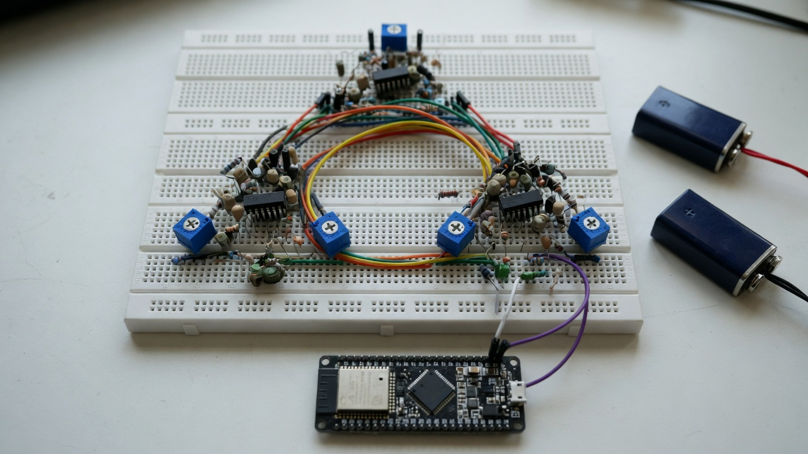
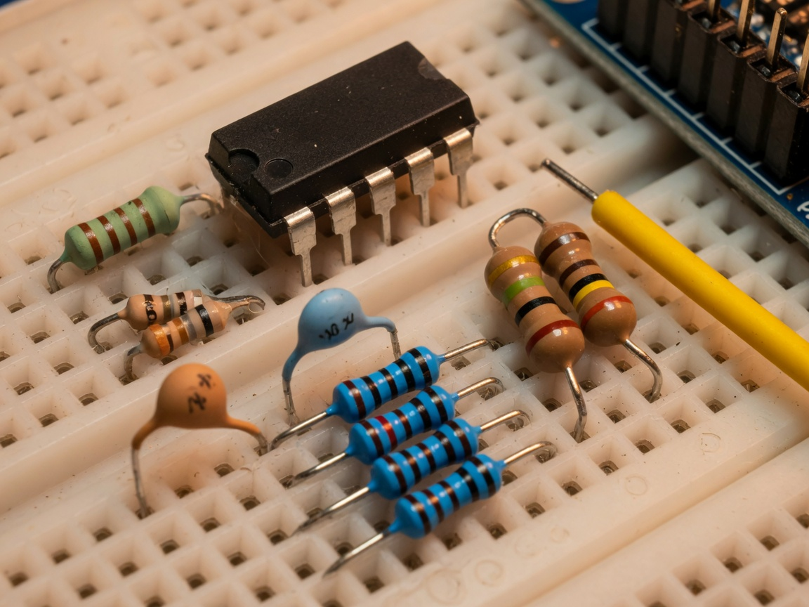
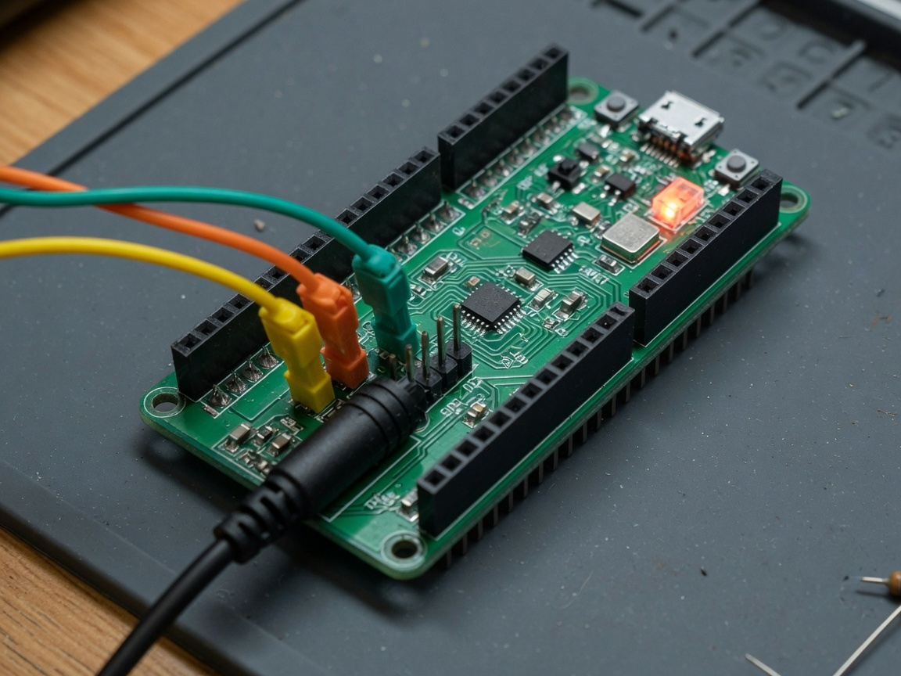

# Build tutorial — prove FSOT lock on a breadboard

This is the afternoon experiment. You are not tuning a neural net. You are building three identical analog oscillators, tying them in a **triangle**, and checking two pot settings against the golden ratio.

Pin **AEB2AD**. Zero free parameters. If it fails, you used the wrong object — you do not add a coefficient.



*Layout idea: three analog islands in a loop, ESP32 as the logger, 9 V batteries off to the analog side. The photo is a mood board (it shows extra trimmers). Your BOM uses **three** coupling pots.*

---

## 0. Why this circuit exists

FSOT trits are \((-1,0,+1)\). A Chua oscillator’s voltage already lives in three regions:

| Voltage at \(V_{C1}\) | Trit | Name |
|-----------------------|------|------|
| \(< -1\,\mathrm{V}\) | \(-1\) | inhibition / damping |
| \(\lvert V\rvert\le 1\,\mathrm{V}\) | \(0\) | quiescent / inner |
| \(> +1\,\mathrm{V}\) | \(+1\) | excitation / emergence |

The ESP32 12-bit ADC is the observer. Coupling is the T³ / \(\kappa\) interaction: when three **identical** nodes share a closed loop, they lock above a threshold \(\sigma_c\) that FSOT predicts with zero free parameters (pin AEB2AD, Branch L inductor loss, see `docs/BRANCH_L_DERIVATION.md`):

\[
\sigma_c=1.4897\;\Rightarrow\;R_c^{\ast}=\frac{\alpha R}{\sigma_c}=12.08\,\mathrm{k}\Omega,\qquad
\sigma=\varphi^2\;\Rightarrow\;R_c=\frac{10\times 1800}{\varphi^2}=6875.39\,\Omega\ (\text{robust lock})
\]

The threshold is the sharp prediction; \(\varphi^2\) is the robust gate. (\(\varphi\), 11.12 kΩ, also locks, but only because \(\sigma_c<\varphi\).) Measure the inductor's Q at 3.4 kHz first: Branch L predicts **25.44**.

---

## 1. What the 3% taught us (do not skip)

The first sim used:

1. A **chain** A—B—C (ends are not the same as the middle).
2. Literature Chua slopes \(a,b=-1.143,-0.714\) (those are **fits**).
3. An invented lock cut `0.85`.
4. Then \(\alpha/\varphi\) picked because it was close.

That is the opposite of the theory. The remedy:

| Must be | Is |
|---------|----|
| Identical nodes | **Ring / triangle**, degree 2 each |
| Slopes from parts | Kennedy NIC resistors → \(G_a=-1/1320\), \(G_b=-9/22000\), \(G_c=101/22000\) S |
| Seed-closed lock | trit \(\ge\varphi^{-1}\), MAD/amp \(\le\varphi^{-4}\) |
| Prediction named first | \(\sigma_c=1.4897\) (locked, sha256 `04ebe3f4…`/`d6bd17be…`), robust gate \(\sigma=\varphi^2\) |
| Honest integration | 2000 τ, no clip, lock requires no escape beyond \(B_{p2}\) |

After that (2000 τ, 6 random initial conditions): 6/6 lock at \(\varphi^2\) and at \(\varphi\), 0/6 at \(\sigma=1\) and at 20 kΩ (escaped), and the sweep threshold is 1.525 against the predicted 1.4897. BOM catalog residual at Electromagnetism is **0.0382%** (AEB2AD).

---

## 2. Parts (absolute)

Full buy list with function: [`../hardware/BOM.md`](../hardware/BOM.md).

**You cannot skip:**

- 3 × TL082 (or TL072) dual op-amps — they **need ±9 V**
- 3 × 22 mH, 10 nF, 100 nF, 1.80 kΩ
- NIC resistors per node: 2×220 Ω, 2.2 kΩ, 2×22 kΩ, 3.3 kΩ
- 3 × 20 kΩ pots (the triangle)
- per node 300 kΩ + 100 kΩ + 150 kΩ (ADC bias, \(v=1.65+V_{C1}/6\)) + 2 × 1N4148 (ESP32 safety)
- 1 × ESP32-WROOM-32 DevKit V1
- 2 × 9 V batteries (analog only)



*One island: op-amp, inductor, capacitors, resistor cluster, bias resistors toward the ADC jumper (photo shows the old 100 k/100 k network; use 300 k / 100 k / 150 k).*

---

## 3. Where things go

Pin-accurate notes: [`../hardware/schematic.md`](../hardware/schematic.md).

### Power (two islands)

| Island | Source | Touches |
|--------|--------|---------|
| Analog | ±9 V batteries | All three TL082 V+ / V−, analog GND |
| Digital | USB 5 V → DevKit 3.3 V | ESP32 only |
| Star ground | **one** jumper | Analog GND hole ↔ ESP32 GND |

If a 9 V lead hits GPIO 34, that pad is dead. Leave empty breadboard rows between the batteries and the DevKit.

### ESP32 DevKit V1 (USB facing you)



**Left header** (the ADC side on a 30-pin DOIT board):

| Node | Pin | Function |
|------|-----|----------|
| A \(V_{C1}\) after bias | **GPIO 34** | ADC1_CH6, **input only** |
| B | **GPIO 35** | ADC1_CH7, input only |
| C | **GPIO 32** | ADC1_CH4 |
| Ground | **GND** (beside VIN) | Star point |
| LED (do not wire) | GPIO 2 | Onboard, firmware lock lamp |

GPIO 34 and 35 **cannot** be outputs. They have no internal pull-ups. That is why they are the right ADC pins.

### Triangle coupling

```
A ---- pot AB (6.88 kΩ / 20 kΩ / sweep) ---- B
 \                           /
  \                         /
   pot CA                 pot BC
    \                     /
     \                   /
      -------- C --------
```

Each pot sits between two `VC1` nodes, **before** the bias network.

### Bias (per node, the only ESP32 interface)

```
VC1 -- 300k --+-- GPIO
              |
             150k to GND
              |
             100k to 3V3
              + 1N4148 to 3V3
              + 1N4148 to GND
```

Map: \(v_{\mathrm{ADC}}=1.65+V_{C1}/6\). The double scroll (±4.33 V) stays inside 0.93–2.37 V and the outer-cycle escape (±7.35 V) inside 0.43–2.88 V, so the firmware can see an escape. (The old 100 k/100 k/100 k network gives \(1.1+V/3\), not the documented \(1.65+V/2\).)

---

## 4. Build order (do not power analog first)

1. Seat the three TL082s. Wire ±9 V **but do not connect batteries yet**.
2. Build node A tank: R, L, C1, C2, NIC resistors. Repeat B, C. Keep the three islands copies of each other.
3. Wire the three pots into a triangle on the three `VC1` nets.
4. Wire the three bias networks. Check with a DMM that each ADC node is ~1.65 V with analog power still **off** (only USB 3.3 V).
5. USB-power the ESP32. Flash firmware (`firmware/README.md`). Confirm `FSOT_RLC_HARDWARE_BOOT=ok`.
6. **Then** connect 9 V batteries. If the DevKit resets or smells, disconnect immediately — a clamp or bias is wrong.
7. DMM the three pots to **20 kΩ**, then **6.88 kΩ**, then sweep 13 → 11 kΩ. Watch UART.

---

## 5. The two tests that prove the model

| Test | All three pots | Must happen |
|------|----------------|-------------|
| Unlocked | 20 kΩ (\(\sigma=0.9<\sigma_c\)) | `FSOT_RLC_LOCK=0` and `FSOT_RLC_AMP_OK=0`: the ring escapes to the outer ±7.35 V cycle. The trits may agree there, which is why LOCK needs the amplitude condition |
| Locked (robust) | **6.88 kΩ** (\(\sigma=\varphi^2\)) | `FSOT_RLC_LOCK=1`, `AMP_OK=1`, three trits equal |
| Threshold (sharp) | step 13 kΩ → 11 kΩ in 0.1 kΩ steps | LOCK first appears at \(R_c^{\ast}=12.08\,\mathrm{k}\Omega\) predicted (11.70–12.50 kΩ) |

If unlocked looks locked, you have a ground loop or the pots are not actually 20 kΩ. If locked never happens, the three nodes are not copies (wrong R or C on one island) or analog rails are collapsing.

You do **not** turn a pot until a residual goes away. The predictions are the 12.08 kΩ threshold and the 6.88 kΩ lock.

---

## 6. What the firmware is doing

Same collapse as the Lean ESP32 observer: \(\Theta=C_{\mathrm{eff}}P_{\mathrm{var}}\). Voltage trits use the Chua breakpoints \(\pm 1\,\mathrm{V}\). Frames:

```
FSOT_RLC_NODE|i|adc_code|volts|trit
FSOT_RLC_LOCK=0|1
```

Host twin (no board): `python firmware/host_observer.py`.

---

## 7. Cross-verify (same spirit as FSOT-2.1-Lean)

```powershell
python -m sim.run_sim
python verification\verify_circuit.py
z3 verification\circuit_bounds.smt2
```

| Layer | Artifact |
|-------|----------|
| A pin / seeds | `sim/fsot_engine.py` SHA prefix `AEB2AD` |
| B ODE + catalog | `results/sim_report.json` `overall_ok` |
| C rust Θ / φ parity | `verification/verify_circuit.py` |
| D SMT | `verification/circuit_bounds.smt2` |
| D Lean integers | `formal/CircuitArrayPriors.lean` |

The full seven-way gauntlet (Coq / Isabelle / F* / TLA+) lives in the Lean hub. This lab exports the same obligation shape so it can be absorbed as a panel there.

---

## 8. Safety

- ±9 V analog, 3.3 V digital, one star ground.
- Clamps on every ADC node before you ever connect GPIO.
- GPIO 34/35 are input-only — never `digitalWrite` them.
- Disconnect batteries before unplugging USB.
